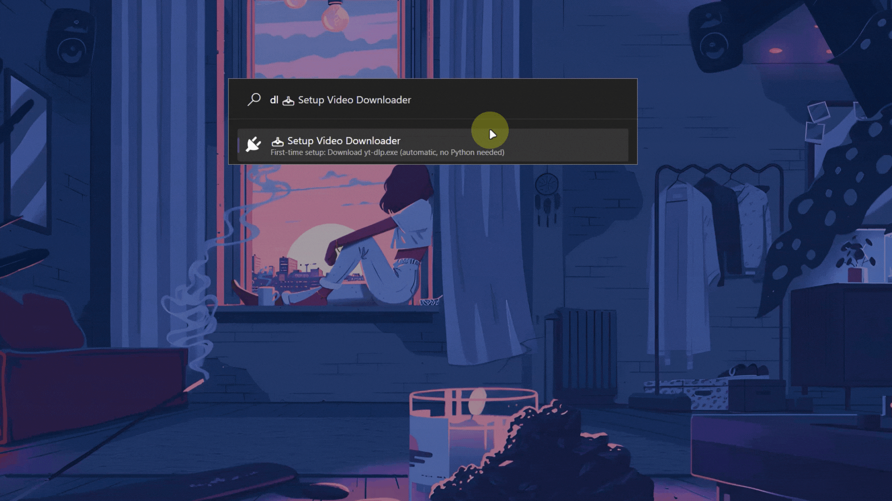
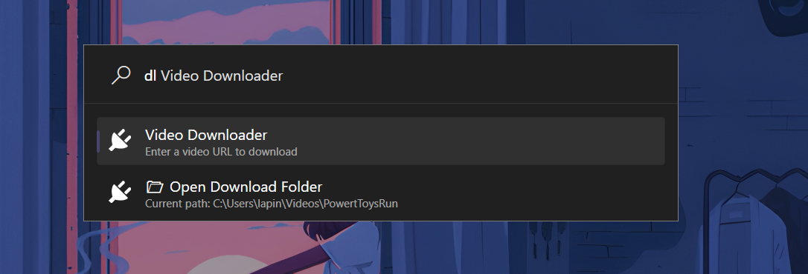
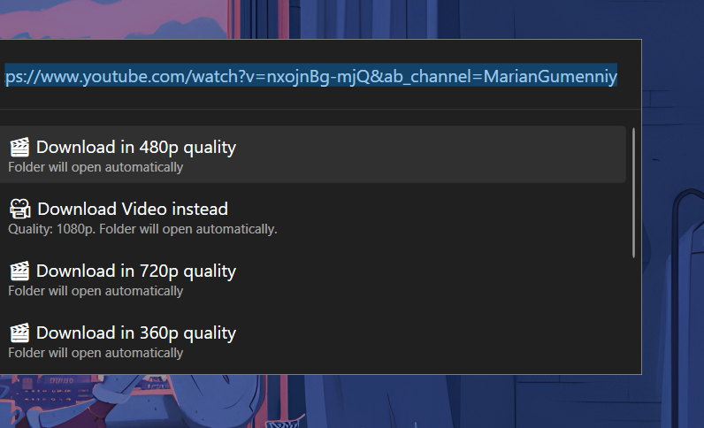
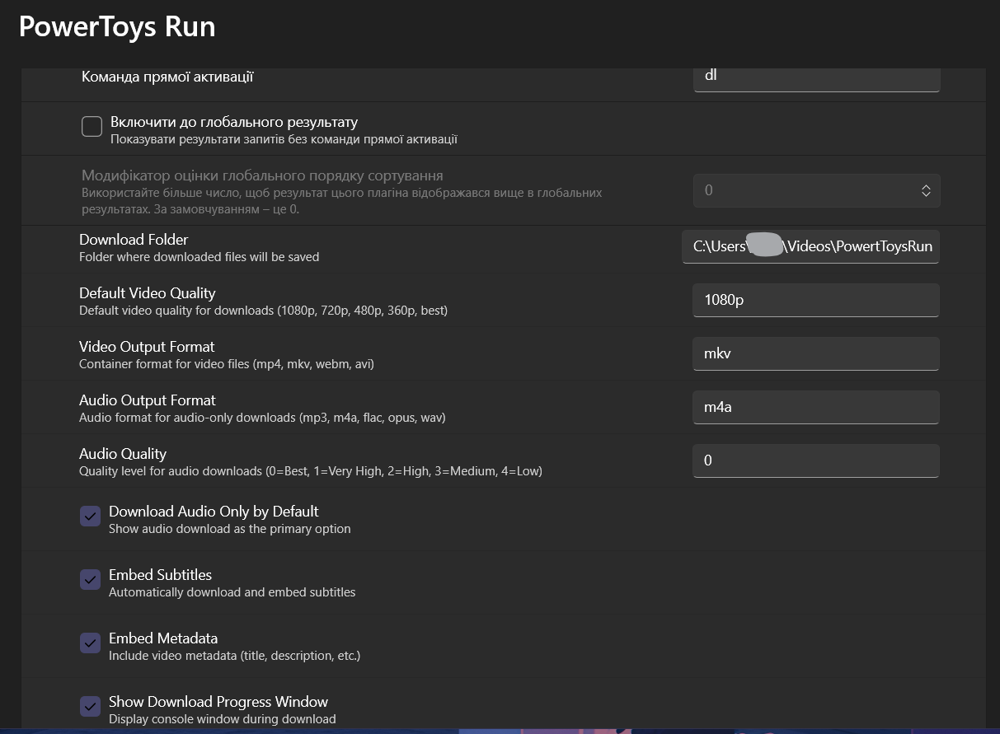
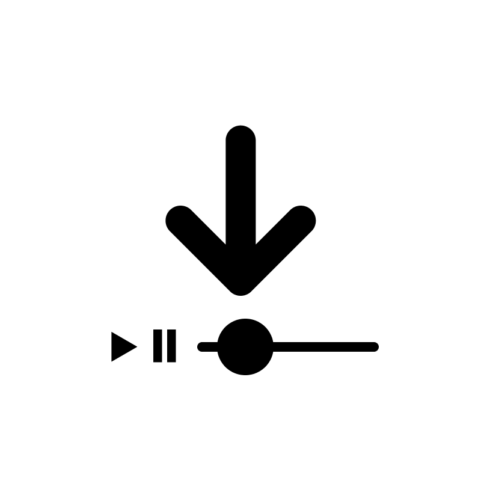
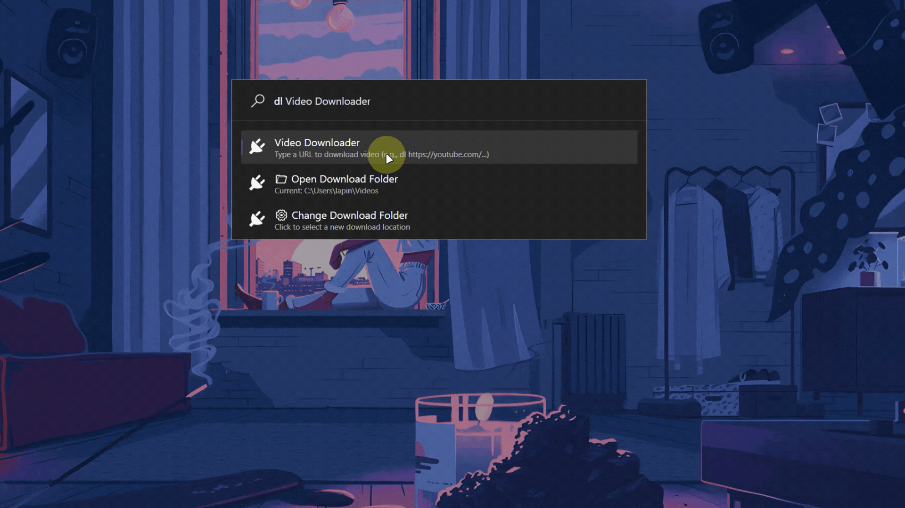
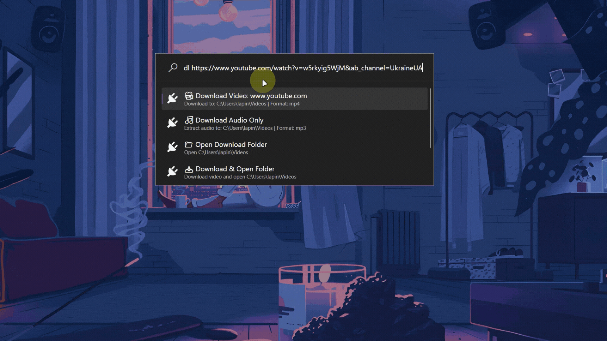

# 🎥 PowerToys Run: Video Downloader

<div align="center">
  <a href="https://github.com/ruslanlap/PowerToysRun-VideoDownloader/releases/tag/v1.10" download style="display: inline-block; margin: 1rem 0;">
    
  </a>
  <p><small>Latest version: v1.10 (x64 & ARM64) | 
    <a href="https://github.com/ruslanlap/PowerToysRun-VideoDownloader/releases/latest">Other versions</a> | 
    <a href="VideoDownloader/Community.PowerToys.Run.Plugin.VideoDownloader/CHANGELOG.md">Changelog</a>
    
  </small></p>
</div>

## 📊 Download Statistics

<div align="center">
  
  
</div>


> ⚠️ **Warning:** This project is created for educational purposes only. Use of this software for downloading videos is at your own risk and responsibility. Please respect copyright laws and terms of service of the platforms you download from.

> ⚠️ **Technical Note:** Muxed streams are deprecated by YouTube and are not guaranteed to be available for every video. If possible, avoid relying on them too much and instead perform muxing manually using the provided audio-only and video-only streams.

> Note: Starting with v1.10, subtitle and metadata features were removed to improve speed and reliability for most users and videos. If you need subtitles, please use v1.0.9.

<div align="center">
<p align="center">
  
</p>
  <h1>📥 Video Downloader for PowerToys Run</h1>
  <h3>Download videos from YouTube and 1000+ other sites directly from your keyboard</h3>

  <!-- Badges -->
  <a href="https://github.com/ruslanlap/PowerToysRun-VideoDownloader/actions/workflows/build-and-release.yml">
    
  </a>
  <a href="https://github.com/ruslanlap/PowerToysRun-VideoDownloader/releases/latest">
    
  </a>
  <a href="https://github.com/ruslanlap/PowerToysRun-VideoDownloader/releases/latest">
    
  </a>
  
  
  
  
  <a href="https://github.com/ruslanlap/PowerToysRun-VideoDownloader/stargazers">
    
  </a>
  <a href="https://github.com/ruslanlap/PowerToysRun-VideoDownloader/issues">
    
  </a>
  <a href="https://github.com/ruslanlap/PowerToysRun-VideoDownloader/releases/latest">
    
  </a>
  <a href="https://opensource.org/licenses/MIT">
    
  </a>
  
  
  
  
  </a>
  
</div>

<div align="center">
  <a href="https://github.com/ruslanlap/PowerToysRun-VideoDownloader/releases/latest">
    
  </a>
</div>

<div align="center">
  
  
  
  <a href="https://github.com/hlaueriksson/awesome-powertoys-run-plugins">
    
</div>

---

## 📋 Table of Contents
- [📝 Overview](#-overview)
- [🌟 Features](#-features)
- [⚡ Quick Start](#-quick-start)
- [🎬 Demo](#-demo)
- [📚 Usage](#-usage)
- [⚙️ Configuration](#️-configuration)
- [🛠️ Building from Source](#️-building-from-source)
- [🤝 Contributing](#-contributing)
- [❓ FAQ](#-faq)
- [📄 License](#-license)
- [🙏 Acknowledgements](#-acknowledgements)
- [🛠️ Troubleshooting](#-troubleshooting)

## 📝 Overview

**VideoDownloader** is a PowerToys Run plugin that lets you download videos from the internet instantly from your keyboard. Just type `dl [URL]` in PowerToys Run (replace `[URL]` with the video URL) and start the download, no browser required!

- **Plugin ID:** `B8F9B9F5C3E44A8B9F1F2E3D4C5B6A7B`
- **Action Keyword:** `dl`
- **Platform:** Windows 10/11 (x64, ARM64)
- **Tech:** C#/.NET, WPF, PowerToys Run API

## 🌟 Features

- 🚀 **One-Click Downloads** - Download videos with a single command
- 🎥 **Multiple Formats** - Supports both video (MP4) and audio-only (MP3) downloads
- 🔍 **Smart URL Detection** - Automatically recognizes video URLs from various platforms
- ⚡ **Lightning Fast** - Built with performance in mind
- 🎨 **Dark/Light Theme** - Seamlessly integrates with your system theme
- 📂 **Custom Download Folder** - Choose where to save your downloads
- 🛠️ **No Dependencies** - Auto-downloads required components
- 🌍 **1000+ Sites** - Works with YouTube, Vimeo, and many more via yt-dlp

## 🔔 Quick Start

<div style="float: right; margin: 0 0 20px 20px;">
  
</div>

1. Download the latest release from the [Releases page](https://github.com/ruslanlap/PowerToysRun-VideoDownloader/releases/latest)
2. Extract the ZIP file
3. Copy the extracted folder to `%LOCALAPPDATA%\Microsoft\PowerToys\PowerToys Run\Plugins\`
4. Restart PowerToys
5. Press `Alt+Space` to open PowerToys Run
6. Type `dl [URL]` to download a video URL, and hit Enter!

---

## 🎬 Demo

<div align="center">
  <a href="assets/demo1.png"></a>
  <a href="assets/demo2.png"></a>
  <a href="assets/demo3.png"></a>
</div>

## 📚 Usage

<div style="display: flex; align-items: center; margin-bottom: 20px;">
  <div style="flex: 2;">
    <h3>Basic Commands</h3>
    <ul>
      <li><code>dl [URL]</code> - Download a video in the best quality</li>
    </ul>
  </div>
  <div style="flex: 1; text-align: center;">
    
  </div>
</div>

### Examples

```
dl https://www.youtube.com/watch?v=dQw4w9WgXcQ

```

## ⚙️ Configuration

Access settings through PowerToys Settings → PowerToys Run → Plugin Manager → Video Downloader

### Available Settings:
- **Action Keyword**: Change from default `dl` if desired
- **Default Download Location**: Set your preferred download folder
- **Audio Format**: Choose between MP3, M4A, etc.
- **Video Format**: Choose between MP4, MKV, etc.
- **Auto-Open Folder**: Open download folder after completion

## 🛠️ Building from Source

### Prerequisites
- [.NET 9.0 SDK](https://dotnet.microsoft.com/download/dotnet/9.0)
- [Visual Studio 2022](https://visualstudio.microsoft.com/)
- [PowerToys](https://github.com/microsoft/PowerToys)

### Build Steps
```bash
git clone https://github.com/ruslanlap/PowerToysRun-VideoDownloader.git
cd PowerToysRun-VideoDownloader
dotnet restore
dotnet build -c Release
```

The built plugin will be in `bin\Release\net9.0-windows10.0.22621.0`

## 🤝 Contributing

Contributions are welcome! Please submit a [pull request](https://github.com/ruslanlap/PowerToysRun-VideoDownloader/pulls) to suggest changes.

## 📄 License

This project is licensed under the MIT License - see the [LICENSE](LICENSE) file for details.

## 🙏 Acknowledgements

- [Microsoft PowerToys](https://github.com/microsoft/PowerToys) team
- [yt-dlp](https://github.com/yt-dlp/yt-dlp) for the amazing video downloader
- [YoutubeExplode](https://github.com/Tyrrrz/YoutubeExplode) for YouTube support

## 🛠️ Troubleshooting

### Common Issues
- **Plugin not showing up**: Ensure you've extracted to the correct folder and restarted PowerToys
- **Download fails**: Check your internet connection and try again
- **Video not supported**: Some sites may have restrictions
- **yt-dlp not found**: The plugin will automatically download yt-dlp on first use. Make sure you have internet access
- **Slow downloads**: Try a lower quality setting or check your internet connection

### Getting Help
If you encounter any issues, please [open an issue](https://github.com/ruslanlap/PowerToysRun-VideoDownloader/issues) with the following information:
- Video URL you're trying to download
- Command you used (if any)
- Any error messages received
- Screenshots if applicable

---


## 🎨 Assets

<div align="center">
  <h3>Plugin Icons</h3>
  <div style="display: flex; justify-content: center; gap: 20px; margin: 20px 0;">
    <div style="text-align: center;">
      
      <p>Plugin Logo</p>
    </div>
    <div style="text-align: center;">
      
      <p>Light Theme Icon</p>
    </div>
    <div style="text-align: center;">
      
      <p>Dark Theme Icon</p>
    </div>
  </div>
  
  <p>All assets are available in the <code>assets/</code> directory of this repository.</p>
</div>

---

## 📝 Overview

**VideoDownloader** is a PowerToys Run plugin that lets you download videos from YouTube and 1000+ other sites instantly from your keyboard. Just type `dl` followed by a video URL in PowerToys Run to start downloading—no browser required!

- **Plugin ID:** `9B6621426ABD46EC9C8B30F165866711`
- **Action Keyword:** `dl`
- **Platform:** Windows 10/11 (x64, ARM64)
- **Tech:** C#/.NET, WPF, PowerToys Run API

## ✨ Features
- ⚡ One-command video downloads from PowerToys Run
- 📊 Supports YouTube and 1000+ other video sites
- 🖼️ Modern WPF UI with real-time progress and results
- 🎨 Theme-aware (dark/light icons, adapts to system theme)
- 📝 Copy/share results instantly
- 🛠️ Robust error handling and informative messages
- 🧪 Automated tests and CI/CD (GitHub Actions)

## 🎬 Demo
<div align="center">
  
  
  
</div>

## 🔔 Easy Install
1. [Download the release (x64)](https://github.com/ruslanlap/PowerToysRun-VideoDownloader/releases/download/v1.10/VideoDownloader-1.10-x64.zip)
2. [Download the release (ARM64)](https://github.com/ruslanlap/PowerToysRun-VideoDownloader/releases/download/v1.10/VideoDownloader-1.10-ARM64.zip)
3. Extract to `%LOCALAPPDATA%\Microsoft\PowerToys\PowerToys Run\Plugins\`
4. Restart PowerToys

## 🚀 Usage     
- Open PowerToys Run (`Alt+Space`)    
- Type `dl` followed by a video URL and select the download option
- View real-time progress and detailed results
- Click the result URL to view/share your result online


## 🛠️ Building from Source
- Requires .NET 9.0 SDK and Windows 10/11
- Clone the repo and open `VideoDownloader.sln` in Visual Studio
- Build the `Community.PowerToys.Run.Plugin.VideoDownloader` project (x64 or ARM64)
- Output: `VideoDownloader-x64.zip` or `VideoDownloader-arm64.zip` in the `publish` directory

## 📂 Project Structure
```
VideoDownloader/
├── Community.PowerToys.Run.Plugin.VideoDownloader/  # Plugin source code
├── tests/                                          # Unit & integration tests
├── publish/                                        # Build output
├── screenshots/                                    # Demo and documentation assets
└── .github/workflows/                              # CI/CD workflows
```

## 👥 Contributors

Thank you to all the amazing people who have contributed to this project and create issues for bug reports and feature requests!


## ❓ FAQ
<details>
<summary><b>How do I change the download location?</b></summary>
<p>You can set a custom download folder in the plugin settings. Access it through PowerToys Settings → PowerToys Run → Plugin Manager → Video Downloader.</p>
</details>
<details>
<summary><b>Which video platforms are supported?</b></summary>
<p>The plugin supports YouTube, Vimeo, and 1000+ other sites through yt-dlp. See the <a href="https://github.com/yt-dlp/yt-dlp/blob/master/supportedsites.md" target="_blank">full list of supported sites</a>.</p>
</details>
<details>
<summary><b>Does it work offline?</b></summary>
<p>No, an internet connection is required to download videos.</p>
</details>
<details>
<summary><b>Can I download videos in 4K quality?</b></summary>
<p>Yes, if the source video is available in 4K and the platform allows it. Use the <code>--quality 2160p</code> parameter.</p>
</details>

## 🤔 yt-dlp FAQ

<details>
<summary><b>What are the advantages of using yt-dlp over youtube-dl?</b></summary>
<p>yt-dlp offers additional features and options not available in youtube-dl. It also has an active development community that ensures that bugs are quickly fixed and new features are added.</p>
</details>

<details>
<summary><b>How do I install yt-dlp?</b></summary>
<p>The plugin includes yt-dlp and will automatically download it on first use. For manual installation, you can download the binary from the <a href="https://github.com/yt-dlp/yt-dlp/releases" target="_blank">official releases page</a>.</p>
</details>

<details>
<summary><b>Can I download videos in different formats?</b></summary>
<p>Yes, you can download videos in different formats using yt-dlp. You can specify the format using command-line options or by editing the configuration file.</p>
</details>

<details>
<summary><b>Is it legal to use yt-dlp to download YouTube videos?</b></summary>
<p>Some content on YouTube may be copyrighted, and downloading it without permission may be illegal. Downloading videos from YouTube is against YouTube's Terms of Service. Users are responsible for ensuring they have the right to download and use the content.</p>
</details>

<details>
<summary><b>Can I download entire playlists with yt-dlp?</b></summary>
<p>Yes, yt-dlp lets you download entire playlists by simply pasting the playlist URL. The plugin supports this functionality automatically.</p>
</details>

 

<details>
<summary><b>Can I download audio-only files?</b></summary>
<p>Yes, use the <code>--audio</code> flag to download audio-only files in MP3 format.]</code></p>
</details>

<details>
<summary><b>Is yt-dlp actively maintained?</b></summary>
<p>Yes, yt-dlp is actively maintained by a team of developers who regularly release updates and bug fixes. The plugin automatically checks for yt-dlp updates.</p>
</details>

<details>
<summary><b>Is there a GUI for yt-dlp?</b></summary>
<p>This plugin serves as a GUI for yt-dlp, integrated directly into PowerToys Run. For standalone GUI options, consider:
- <a href="https://github.com/kannagi0303/yt-dlp-gui" target="_blank">yt-dlp-gui</a>
- <a href="https://github.com/oleksis/youtube-dl-gui" target="_blank">youtube-dl-gui</a>
- <a href="https://github.com/kannagi0303/yt-dlp-gui" target="_blank">yt-dlp Web UI</a></p>
</details>

<details>
<summary><b>Can I use yt-dlp on mobile?</b></summary>
<p>This plugin is designed for Windows via PowerToys Run. For mobile use, you'll need to use the command-line version of yt-dlp with a terminal emulator like Termux on Android or a-Shell on iOS.</p>
</details>

## ☕ Support
Enjoying Video Downloader? ☕ Buy me a coffee to support development:

[](https://ruslanlap.github.io/ruslanlap_buymeacoffe/)

## 📄 License
MIT License. See [LICENSE](LICENSE).

## 🙏 Acknowledgements
- [Microsoft PowerToys](https://github.com/microsoft/PowerToys) team
- [yt-dlp](https://github.com/yt-dlp/yt-dlp) - The best YouTube/Video downloader
- [YoutubeExplode](https://github.com/Tyrrrz/YoutubeExplode) - YouTube video/playlist parsing
- All contributors and users!

---

## 🛠️ Troubleshooting

- **Plugin not showing up**  
  Make sure you extracted the plugin to the correct folder and restarted PowerToys.
- **Download fails**  
  Check your internet connection and try again. Some videos may have restrictions.
- **yt-dlp not found**  
  The plugin will automatically download yt-dlp on first use. Make sure you have internet access.
- **Slow downloads**  
  Try a lower quality setting or check your internet connection.

---

## 🔒 Security & Privacy

- The plugin does not store your download history.
- All downloads are performed directly by yt-dlp.
- No third-party APIs or data collection beyond what yt-dlp requires.

---

## 🧑‍💻 Tech Stack

- C# / .NET 9.0
- WPF (UI)
- PowerToys Run API
- yt-dlp (video downloading)
- YoutubeExplode
- GitHub Actions (CI/CD)

---

## 📝 Changelog

### v1.10 (Latest)
- Removed subtitles and metadata features to improve speed and reliability for most users and videos
- If you need subtitles, you can use v1.0.9

### v1.0.8 ✅ PTRUN Compliant
- **🔧 Fixed**: All PowerToys Run linting issues (PTRUN1301, PTRUN1303, PTRUN1401, PTRUN1402)
- **📦 Improved**: Package naming follows `<name>-<version>-<platform>.zip` convention (removed 'v' prefix)
- **🔐 Added**: SHA256 checksums for all release packages
- **⚙️ Enhanced**: Automatic version synchronization between plugin.json and releases
- **🗑️ Removed**: Unnecessary PowerToys dependencies from packages
- **🎯 Optimized**: Reduced package size and improved compatibility
- **🚀 Enhanced**: CI/CD pipeline with proper artifact validation
- **🐛 Bug Fix**: Resolved setup timeout issues
- **⏱️ Improved**: Extended download timeout to 10 minutes
- **📱 Enhanced**: Better user messaging during setup
- **🔧 Fixed**: ARM64 build compatibility

### v1.0.7
- **New Feature**: Added support for viewing available video formats before downloading
  - Click on "ℹ️ Video Information" to see all available formats and qualities
  - View detailed information about each available stream
  - Choose the exact format/quality you want to download

### v1.0.6
- Added support for ARM64 architecture
- Improved plugin settings validation
- Fixed issues with special characters in download paths
- Added more detailed error messages for download failures

### v1.0.5
- Fixed build issues by replacing problematic `Community.PowerToys.Run.Plugin.Dependencies` package with standard PowerToys dependencies:
  - Added `Microsoft.PowerToys.Settings.UI.Library` (v0.75.0)
  - Added `Wox.Plugin` (v1.4.0)
- Updated GitHub Actions workflow for proper artifact naming and build process:
  - Fixed all references from "SpeedTest" to "VideoDownloader"
  - Corrected project paths and build directories
  - Added explicit NuGet source configuration
  - Added dedicated restore step before building
- Added proper support for both x64 and ARM64 builds
- Fixed NuGet package references for better compatibility with PowerToys v0.75+
- Enhanced README with additional badges, better documentation, and improved formatting
- Updated UnitTests project to target .NET 9.0 to match the main project
- Fixed all links and references to ensure consistency across the project


---

## 🌐 Localization

<div style="display: flex; align-items: center;">
  <div style="flex: 3;">
    <p>Currently, the plugin UI is in English. Localization support is planned for future releases.</p>
    <p>Contributions for translations are welcome! If you'd like to help translate the plugin to your language, please check the <a href="CONTRIBUTING.md">Contributing Guidelines</a>.</p>
  </div>
  <div style="flex: 1; text-align: center;">
    
  </div>
</div>

---

## 📸 Demo & Screenshots

### Basic Usage
<div align="center">
  <figure>
    
    <figcaption>Downloading a video with default settings using the 'dl' command</figcaption>
  </figure>
</div>

### Audio Download & Format Selection
<div align="center">
  <figure>
    
    <figcaption>Downloading audio-only (MP3) and selecting different video qualities</figcaption>
  </figure>
</div>

### Advanced Features
<div align="center">
  <figure>
    
    <figcaption>Using advanced features: opening download folder and changing download location</figcaption>
  </figure>
</div>

### Available Video Formats
<div align="center">
  <figure>
    
    <figcaption>View all available video formats and qualities before downloading</figcaption>
  </figure>
</div>

### Theme Support
<div align="center" style="display: flex; justify-content: center; gap: 40px; margin: 20px 0;">
  <figure style="text-align: center;">
    
    <figcaption>Dark Theme</figcaption>
  </figure>
  <figure style="text-align: center;">
    
    <figcaption>Light Theme</figcaption>
  </figure>
</div>

---

<div align="center">
  <sub>Made with ❤️ by <a href="https://github.com/ruslanlap">ruslanlap</a></sub>
</div>
