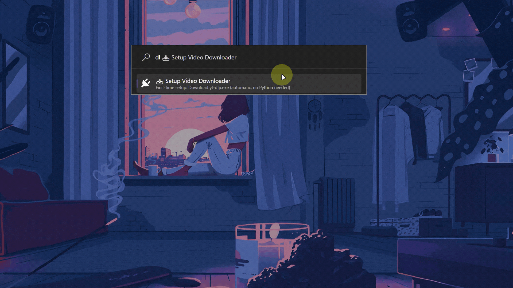
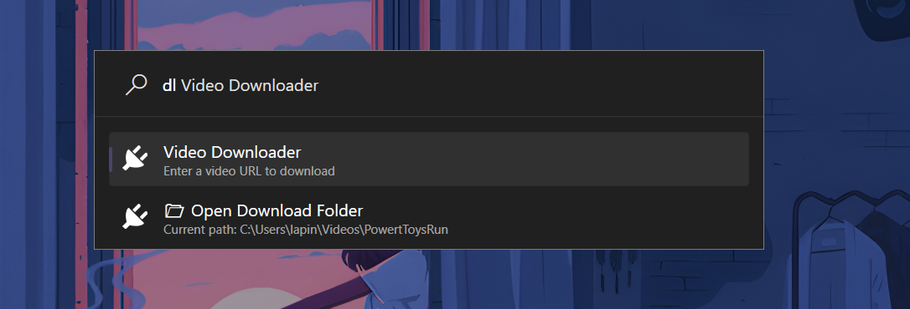
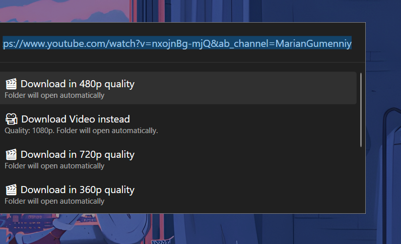
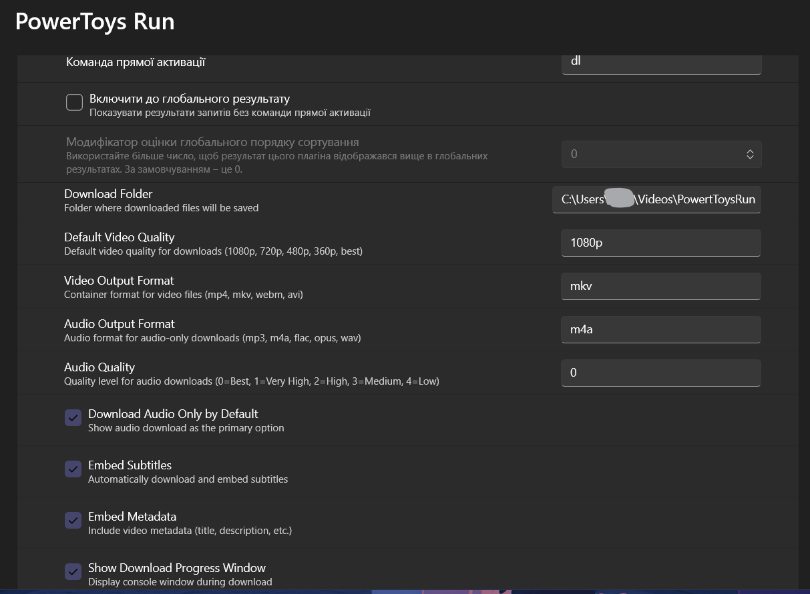

# 🎥 Video Downloader for PowerToys Run

<div align="center">



**Download videos from YouTube and 1000+ sites directly from your keyboard**

[](https://github.com/ruslanlap/PowerToysRun-VideoDownloader/releases/latest)
[](https://github.com/ruslanlap/PowerToysRun-VideoDownloader/releases)
[](https://github.com/ruslanlap/PowerToysRun-VideoDownloader/actions)
[](LICENSE)

[](https://github.com/microsoft/PowerToys)
[](https://dotnet.microsoft.com)
[](https://www.microsoft.com/windows)
[](https://github.com/ruslanlap/PowerToysRun-VideoDownloader/releases)
[](https://github.com/hlaueriksson/awesome-powertoys-run-plugins)

[🚀 Quick Install](#-installation) · [📖 Usage Guide](#-usage) · [⚙️ Configuration](#️-configuration) · [❓ FAQ](#-faq)

---

### 📥 Download Latest Release

<div align="center">

[-0078D4?style=for-the-badge&logo=windows&logoColor=white>)](https://github.com/ruslanlap/PowerToysRun-VideoDownloader/releases/latest/download/VideoDownloader-1.0.11-x64.zip)
[-50FA7B?style=for-the-badge&logo=windows&logoColor=white>)](https://github.com/ruslanlap/PowerToysRun-VideoDownloader/releases/latest/download/VideoDownloader-1.0.11-ARM64.zip)

**Latest Version: v1.0.11** | [View All Releases](https://github.com/ruslanlap/PowerToysRun-VideoDownloader/releases)

</div>

</div>

---

## ⚡ Overview

**VideoDownloader** seamlessly integrates video downloading into PowerToys Run. Type `dl` followed by any video URL and download instantly—no browser, no extra tools, just pure productivity.

- **Action Keyword:** `dl`
- **Platforms:** YouTube, Vimeo, and [1000+ sites](https://github.com/yt-dlp/yt-dlp/blob/master/supportedsites.md)
- **Architectures:** x64 & ARM64
- **Requirements:** Windows 10/11, PowerToys v0.75+

> ⚠️ **Educational purposes only.** Respect copyright laws and platform terms of service. This tool doesn't bypass DRM or paid content restrictions.

---

## ✨ Features

- ⚡ **One-Command Downloads** – Type URL, hit Enter, done
- 🎬 **Multiple Formats** – MP4 video, MP3 audio, various qualities
- 📊 **Format Preview** – View all available qualities before downloading
- 🎨 **Theme-Aware** – Auto-adapts to dark/light system theme
- 📂 **Custom Locations** – Save to any folder you choose
- 🔄 **Auto-Updates** – yt-dlp auto-downloaded and managed
- 📝 **Subtitle Support** – Download with captions when needed
- 🚀 **No Dependencies** – Everything bundled, zero config

---

## 🚀 Installation

### Quick Install

1. **Download** the latest release:
    - [x64 Release](https://github.com/ruslanlap/PowerToysRun-VideoDownloader/releases/latest/download/VideoDownloader-1.0.11-x64.zip)
    - [ARM64 Release](https://github.com/ruslanlap/PowerToysRun-VideoDownloader/releases/latest/download/VideoDownloader-1.0.11-ARM64.zip)

2. **Extract** to:

    ```
    %LOCALAPPDATA%\Microsoft\PowerToys\PowerToys Run\Plugins\
    ```

3. **Restart** PowerToys (right-click tray icon → Exit, then relaunch)

4. **Test** by pressing `Alt+Space` and typing `dl`

### Manual Build

```bash
git clone https://github.com/ruslanlap/PowerToysRun-VideoDownloader.git
cd PowerToysRun-VideoDownloader
dotnet restore
dotnet build -c Release
```

Output: `VideoDownloader/bin/Release/net9.0-windows10.0.22621.0/`

---

## 📚 Usage

### Basic Download

```
dl https://www.youtube.com/watch?v=dQw4w9WgXcQ
```

### Available Options

| Command                       | Description                 |
| ----------------------------- | --------------------------- |
| `dl [URL]`                    | Download best quality video |
| Select "Audio Only (MP3)"     | Extract audio as MP3        |
| Select "Video Information"    | Preview available formats   |
| Select "Open Download Folder" | Open downloads location     |

### Examples

<div align="center">

|  |  |  |
| :-------------------------: | :-------------------------: | :-------------------------: |
|       Basic download        |      Audio extraction       |      Format selection       |

</div>

---

## ⚙️ Configuration

Access via: **PowerToys Settings → Run → Plugins → Video Downloader**

### Settings

- **Action Keyword** – Change from default `dl`
- **Download Location** – Set custom save folder
- **Default Format** – Video (MP4) or Audio (MP3)
- **Quality Preference** – Best, 1080p, 720p, etc.
- **Auto-Open Folder** – Open location after download

---

## 🛠️ Building from Source

### Prerequisites

- [.NET 9.0 SDK](https://dotnet.microsoft.com/download/dotnet/9.0)
- [Visual Studio 2022](https://visualstudio.microsoft.com/) (or Rider/VS Code)
- [PowerToys](https://github.com/microsoft/PowerToys) installed

### Build

```bash
# Clone repo
git clone https://github.com/ruslanlap/PowerToysRun-VideoDownloader.git
cd PowerToysRun-VideoDownloader

# Restore and build
dotnet restore
dotnet build -c Release

# Package for distribution
cd VideoDownloader
dotnet publish -c Release -r win-x64 --self-contained false
```

### Project Structure

```
PowerToysRun-VideoDownloader/
├── VideoDownloader/
│   └── Community.PowerToys.Run.Plugin.VideoDownloader/
│       ├── Main.cs                    # Plugin entry point
│       ├── VideoDownloadService.cs    # Core download logic
│       └── plugin.json                # Plugin metadata
├── tests/                             # Unit tests
├── assets/                            # Icons, demos, screenshots
├── .github/workflows/                 # CI/CD automation
└── README.md
```

---

## ❓ FAQ

<details>
<summary><b>Which sites are supported?</b></summary>

YouTube, Vimeo, Twitch, TikTok, and [1000+ more](https://github.com/yt-dlp/yt-dlp/blob/master/supportedsites.md) via yt-dlp.

</details>

<details>
<summary><b>Can I download 4K videos?</b></summary>

Yes, if the source provides 4K and your download location has sufficient space.

</details>

<details>
<summary><b>Does it work with playlists?</b></summary>

Yes, paste a playlist URL and it'll download all videos sequentially.

</details>

<details>
<summary><b>Is it legal?</b></summary>

Downloading copyrighted content without permission violates most platforms' ToS. Use responsibly and only for content you have rights to download.

</details>

<details>
<summary><b>Plugin not showing up?</b></summary>

1. Verify extraction to `%LOCALAPPDATA%\Microsoft\PowerToys\PowerToys Run\Plugins\`
2. Ensure folder name matches: `Community.PowerToys.Run.Plugin.VideoDownloader`
3. Restart PowerToys completely (Exit from tray)
4. Check PowerToys Settings → Run → Plugins → Enable "Video Downloader"

</details>

<details>
<summary><b>Download fails with "yt-dlp not found"?</b></summary>

The plugin auto-downloads yt-dlp on first use. Ensure internet connectivity and try again.

</details>

<details>
<summary><b>How do I update yt-dlp?</b></summary>

The plugin checks for yt-dlp updates automatically. You can manually update by deleting the yt-dlp binary from the plugin folder—it'll re-download latest on next use.

</details>

---

## 🛠️ Troubleshooting

| Issue                    | Solution                                                      |
| ------------------------ | ------------------------------------------------------------- |
| **Plugin not appearing** | Extract to correct folder, restart PowerToys                  |
| **Download hangs**       | Check internet connection, try different quality              |
| **"Video unavailable"**  | Site may block downloads or require login                     |
| **Slow downloads**       | Try lower quality or check bandwidth                          |
| **yt-dlp errors**        | Delete `yt-dlp.exe` from plugin folder to trigger re-download |

Still stuck? [Open an issue](https://github.com/ruslanlap/PowerToysRun-VideoDownloader/issues) with:

- Video URL
- Error message
- Screenshot

---

## 📝 Changelog

### v1.0.11 (Latest)

- ✨ Added subtitle download option
- ⚡ Improved download speed
- 🐛 Fixed metadata handling

### v1.0.8

- ✅ PowerToys Run compliance (PTRUN1301, PTRUN1303, etc.)
- 📦 SHA256 checksums for releases
- 🔧 ARM64 build fixes

[Full changelog](VideoDownloader/Community.PowerToys.Run.Plugin.VideoDownloader/CHANGELOG.md)

---

## 🙏 Acknowledgements

Built with:

- [Microsoft PowerToys](https://github.com/microsoft/PowerToys) – Extensible launcher framework
- [yt-dlp](https://github.com/yt-dlp/yt-dlp) – Universal video downloader
- [YoutubeExplode](https://github.com/Tyrrrz/YoutubeExplode) – YouTube metadata parsing

Special thanks to all [contributors](https://github.com/ruslanlap/PowerToysRun-VideoDownloader/graphs/contributors) and users!

---

## 📄 License

MIT License – see [LICENSE](LICENSE) for details.

---

## ☕ Support

Enjoying this plugin? Support development:

[](https://ruslanlap.github.io/ruslanlap_buymeacoffe/)

---

<div align="center">

**[⬆ Back to Top](#-video-downloader-for-powertoys-run)**

Made with ❤️ by [ruslanlap](https://github.com/ruslanlap)

</div>
